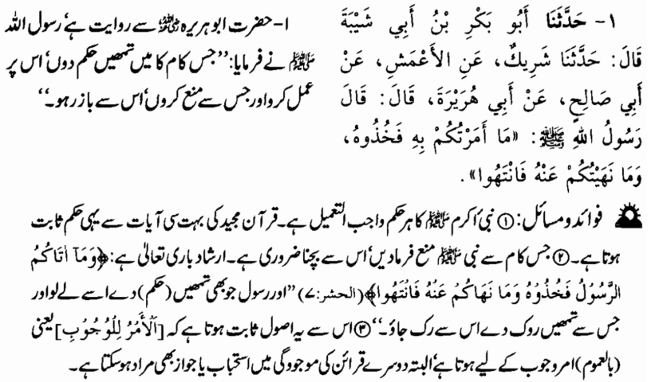
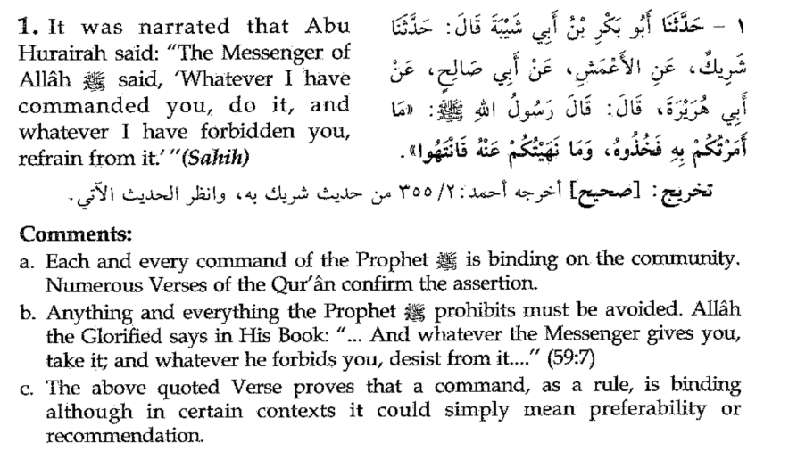

binding → laazmi

Numerous → kai / bahut saari

Verses → aayatein

the assertion → is baat ko

refrain from it → us se ruk jao

desist from it → us se ruk jao

although → lekin

in certain contexts → kuch halaat mein

preferability → behtar hona

or recommendation → ya mashwara / mustahab