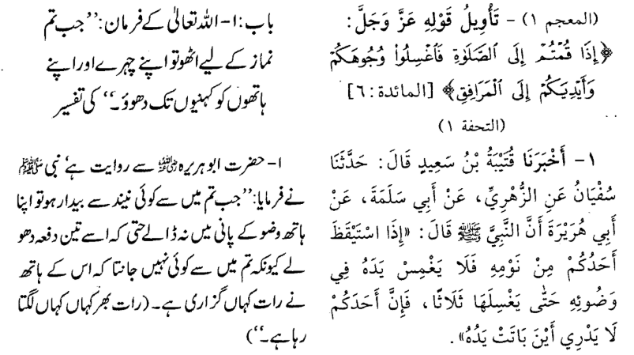
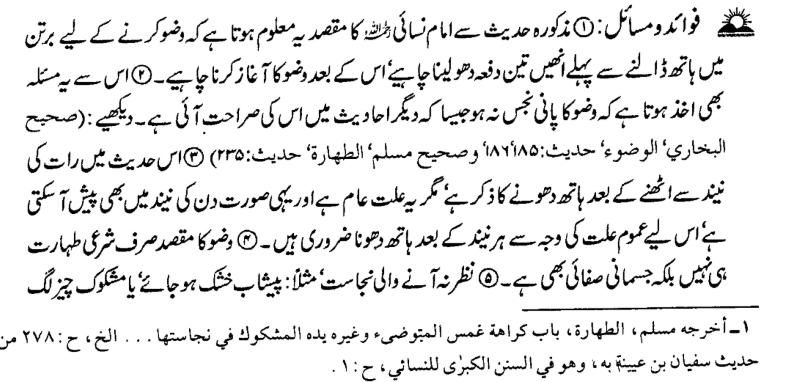
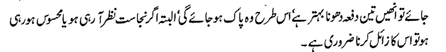
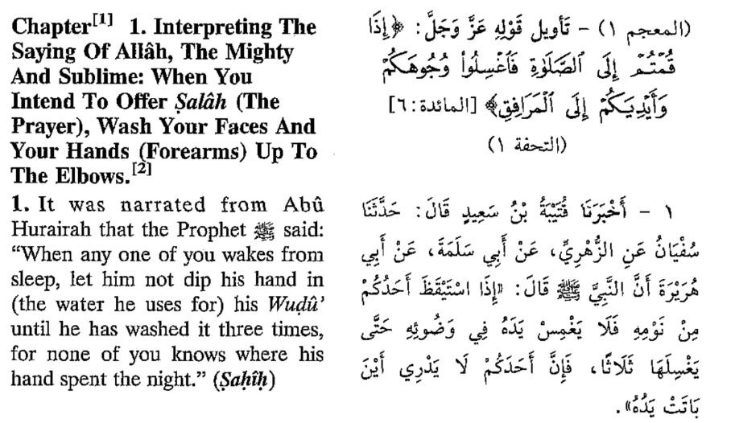
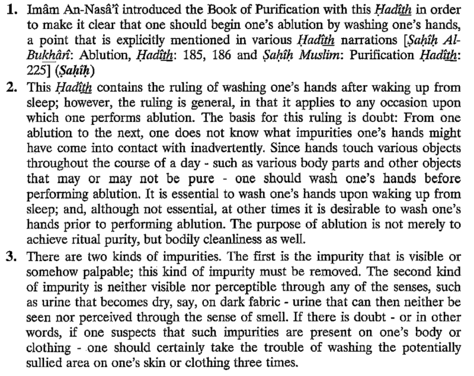

---

* **Interpreting** → tafseer / samajhna (sahi)
* **The Mighty** → qudrat wala / zabardast (better: qudrat wala)
* **And Sublime** → buland / azeem (sahi)

---

* **the Book of Purification** → kitaab-ut-taharah (paaki ki kitaab) ✅ (small correction: *ut*, not *ul*)
* **one’s ablution** → apna wuzu (sahi)
* **that is explicitly mentioned** → jo wazeh taur par zikr ki gayi hai (better than “clearly”)
* **in various Hadīth narrations** → mukhtalif hadith riwayat mein (sahi)
* **to any occasion** → har mauke par / har situation mein (better wording)

---

* **Imām** → deen ka leader / scholar (sahi)
* **introduced** → shuru kiya / pesh kiya (better: *pesh kiya*)
* **Purification (Taharah)** → paaki / taharah (sahi)
* **Hadīth** → Nabi ﷺ ki baat / riwayat (sahi)
* **ablution (Wuḍū’)** → wuzu (sahi)
* **explicitly** → wazeh taur par (better)
* **narrations** → riwayat (better than “bayan” here)

---

* **ruling** → hukm (best)
* **general** → aam (sahi)
* **applies** → lagu hota hai (sahi)
* **occasion** → mauka (sahi)
* **basis** → bunyaad (sahi)
* **doubt** → shak (sahi)

---

* **impurities** → napaaki / gandagi (better: *napaaki*)
* **contact** → chhoo lena / lagna (better: *lagna*)
* **inadvertently** → anjane mein (sahi)
* **various** → mukhtalif (best)
* **objects** → cheezein (sahi)
* **pure** → paak (best)

---

* **essential** → zaroori (sahi)
* **desirable** → mustahab / behtar (better: *mustahab* in Islamic context)
* **prior** → pehle (sahi)
* **purpose** → maqsad (sahi)
* **ritual purity** → shar’i paaki (best)
* **bodily cleanliness** → jismi safai (sahi)

---

* **visible** → nazar aane wali (sahi)
* **palpable** → mehsoos hone wali (sahi)
* **removed** → hataana / door karna (better: *door karna*)
* **perceptible** → mehsoos hone wali (sahi)

---

* **senses** → his (hawas) (better term: *hawas*)
* **urine** → peshab (sahi)
* **fabric** → kapda (sahi)
* **smell** → boo (better than “smell”)

---

* **suspects** → shak karta hai (sahi)
* **present** → maujood (sahi)
* **certainly** → zaroor / yaqeenan (better: *yaqeenan*)
* **take the trouble** → mehnat karna / ehtiyaat karna (better: *ehtiyaat karna*)
* **sullied** → napaak / ganda (better: *napaak*)
* **area** → jagah / hissa (better: *hissa*)
* **skin** → jild (sahi)
