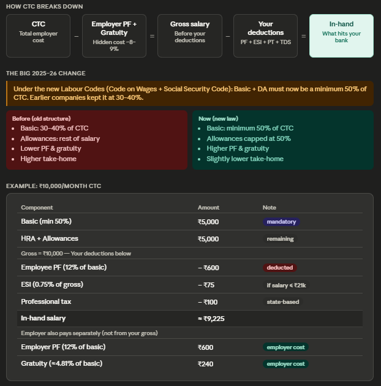
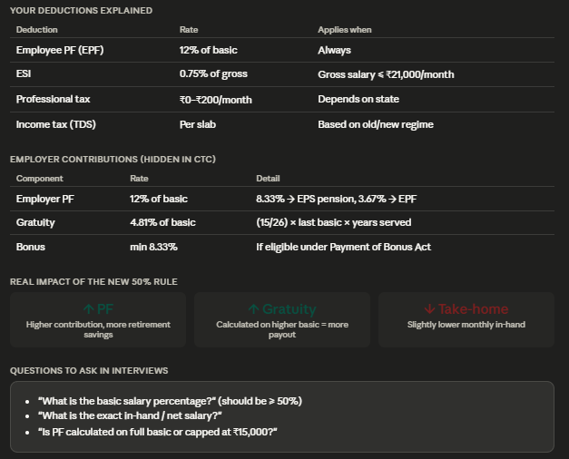

---

### CTC --> Cost to company
* The **total amount a company spends on you** per year. 
* This is the big number on your offer letter — but it is NOT what lands in your bank account.
* The most common mistake: assuming CTC ÷ 12 = monthly take-home. It never does.

```
CTC = In-Hand + PF(Employee + Employer) + Gratuity + Health insurance + Training costs + HRA + All allowances
```

---

### Gross Salary

Your salary **before any deductions** (tax, PF(Employee), etc.) are applied.
```
Gross Salary = Basic(In-Hand) + EPF + HRA + All Allowances
```

---

### Basic Salary

The **core component** of your pay. No exemptions apply here — it is **100% taxable**.
- Usually 40–50% of CTC
- PF and Gratuity are both calculated on Basic
- A lower Basic means more room for tax-saving allowances
- Lower Basic → more allowances → less tax overall.

---

### HRA — House Rent Allowance

Given to cover rent expenses. If you **actually pay rent**, a portion is tax-exempt.

| City Type | Tax-free HRA limit |
|---|---|
| Non-metro cities | Up to 40% of Basic |
| Metro cities (Delhi, Mumbai, etc.) | Up to 50% of Basic |
| Own house | Entire HRA is taxable |

> 💡 Keep your rent receipts — you'll need them during investment declaration.

* You cannot claim HRA tax exemption if you live in your own house.

* **If you own your house and live in it:**
  - HRA will still appear on your salary slip (it's part of your salary structure)
  - But the entire HRA amount becomes **fully taxable**
  - You cannot claim any exemption on it

* **If you own a house but live in a rented place** (e.g., you own a house in your hometown but rent in the city where you work):
  - You **can** still claim HRA exemption for the rent you pay
  - You need to submit rent receipts and your landlord's PAN (if rent exceeds ₹1 lakh/year)

* **If you pay rent to your parents** (and you don't own the house):
  - This is legally allowed
  - You can claim HRA, and your parents declare it as rental income on their side
  - Proper rent agreement is recommended

---

### Medical Allowance

Previously ₹15,000/year was tax-free. It is now merged into the **Standard Deduction**, but some companies still show it separately on the salary slip.

---

### Special Allowances

Companies split part of your salary into specific allowance buckets. When you submit actual bills for these, **that amount is not taxed**.

| Allowance | Example |
|---|---|
| 🍽️ Food / Meal | Restaurant bills, Swiggy receipts |
| 👶 Children's School Fee | School fee receipts |
| 🌐 Internet | Broadband monthly bill |
| 📱 Phone | Mobile postpaid / recharge bill |
| 📚 Books & Magazines | Amazon / bookstore invoice |
| ⛽ Petrol / Conveyance | Petrol pump receipts |

> ⚠️ If you declared ₹40,000 but only submitted ₹30,000 in bills, the remaining ₹10,000 becomes taxable income.

---

### Provident Fund (PF)
- A **government-mandated retirement savings** scheme shared between you and your employer.
```
Your contribution       = 12% of Basic
Employer's contribution = 12% of Basic (matched)
  └─ 8.33% → EPS (Employee Pension Scheme)
  └─ 3.67% → Your PF account
```
- Returns are excellent (~8%+ per year decided by govt, government-backed)
- Can be withdrawn 3 months after leaving a company
- Deducted before salary hits your bank — automatic saving
- Your PF account = your 12% + employer’s 3.67%
- Pension (EPS) = separate benefit for retirement
- PF Withdrawal Rules
  * ✔ Full Withdrawal
    * After retirement (age 58)
    * Or unemployed for 2+ months
  * ✔ Partial Withdrawal (allowed for specific needs)
    * Medical emergency
    * Buying/building house
    * Marriage
    * Education
- PF is EEE (Exempt-Exempt-Exempt):
  * Contribution → tax-free (under 80C)
  * Interest → tax-free
  * Withdrawal → tax-free (after 5 years)
- UAN (Universal Account Number) links all PF accounts
- If you switch jobs → PF can be transferred
- PF = Forced saving + Employer bonus + Safe growth

---

### EPS
- You get monthly pension after retirement.
- EPS = Future pension income
- Your pension under EPS (Employee Pension Scheme) is:
  
- Pensionable salary (EPS cap) = ₹15,000/month (important rule)
- Even if your basic is ₹1,00,000, EPS only considers ₹15,000
- Pension directly proportional to Service years

---

### Gratuity

A **loyalty bonus** from the company — but only paid out after **completing 5 years**.

```
Gratuity = (Basic × 15 × Years of service) ÷ 26
```

- Leave before 5 years → you forfeit it entirely
- It appears in your CTC every month but you never see it until you qualify

- **Cost:** Nothing deducted from employee salary; employer contribution is ~4.81% of basic monthly.
- **Formula:** `(15 ÷ 26) × Last Basic × Years of Service`
- **Eligibility:** 
    - **Strict:** Minimum 5 years of service required (not a single day less).
    - **Exception:** Paid immediately upon death or disability (no 5-year rule).
    - **Reset:** The 5-year clock resets with every new company; service does not transfer.
- **Tax Limit:** Tax-free up to £20,00,000 for private employees.
- **Payout:** Employer must pay within 30 days of leaving (legally enforceable).
- If your last year has more than 6 months, it is rounded UP to the next full year. Example: 7 years 8 months = treated as 8 years. But 7 years 4 months = treated as 7 years.
- If company refuses or underpays, file a complaint with the Controlling Authority (Labour Commissioner) under the Gratuity Act. It is legally enforceable.

---

### Corporate Health Insurance

Health coverage provided by your company — **always use it**. It is often far better than what you can buy individually.

- Can cover you, spouse, children, and sometimes parents
- Included in your CTC calculation
- Some companies also provide term life insurance

---

### The Big Picture — Where Your Money Goes

```
CTC
 └─ − Gratuity provision
     └─ Gross Salary
         └─ − PF (your 12%)
             └─ − Income Tax (TDS)
                 └─ ✅ In-hand / Net Salary
```

---

### How to Increase Your In-Hand Salary

- ✅ Submit actual bills for every allowance you have (food, petrol, phone, internet)
- ✅ Claim HRA if you pay rent — keep rent receipts and landlord's PAN
- ✅ Fill your Investment Declaration at the start of the year, not in March
- ✅ Use your corporate health insurance — don't pay out of pocket unnecessarily
- ❌ Never submit fake bills — it is illegal and can end your career

> 📌 If you skip bills all year and realise in March, a large lump-sum tax gets deducted from your last few salary credits — plan ahead.


---


Here's the full picture, nothing left out:

**The 4 things you must do every year:**

1. **April** — Log into your HRMS portal (Darwinbox, Keka, etc.) and fill the IT Declaration. Enter all allowances you plan to claim + your 80C investments. Skip this and you pay maximum TDS all year.

2. **Every month (Apr–Jan)** — Drop every bill (food, petrol, internet, phone) into a phone folder or Google Drive the same day you get it. Takes 10 seconds.

3. **January–February** — Upload all collected bills + investment proofs to the HRMS portal before the Feb 15 deadline. If bills submitted < declared amount, the gap becomes taxable income.

4. **June–July** — Get your Form 16 from HR, go to incometax.gov.in, and file ITR-1. Takes ~15 minutes. Any excess TDS comes back as a refund in 2–4 weeks.

**One important note:** Your PF contribution (~₹1.92L/yr) already maxes out the ₹1.5L 80C limit automatically — you don't need to do anything extra for that. Just focus on collecting bills and topping up NPS for the extra ₹50,000 deduction.


---





Here's the complete picture of how Indian salary works under the updated 2025–26 labour laws.

The single most important change is the 50% rule — companies can no longer structure your salary with a low basic (like 30–35%) to reduce their PF and gratuity liability. The new labour codes make Basic + DA a minimum 50% of CTC, which means your long-term benefits go up, but your monthly take-home dips slightly compared to the old structure.

The quick mental model: CTC is what the company pays in total. Strip out the employer's PF and gratuity contributions and you get your gross. From that, your own PF (12% of basic), ESI (if applicable), professional tax, and TDS are deducted — what remains is your actual in-hand salary.

Use the buttons at the bottom to calculate your specific in-hand for common salary levels.

