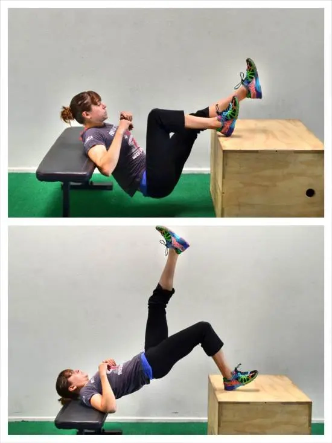

https://github.com/user-attachments/assets/8f9fe8c3-c915-4e9a-a2f6-0008cd8097d7

<video controls="controls" width="500">
  <source src="video1.mp4" type="video/mp4">
</video>

<video controls width="500">
  <source src="./video2.mp4" type="video/mp4">
</video>

<video controls width="500">
  <source src="./video3.mp4" type="video/mp4">
</video>

<video controls width="500">
  <source src="./video4.mp4" type="video/mp4">
</video>

<video controls width="500">
  <source src="./video5.mp4" type="video/mp4">
</video>

<video controls width="500">
  <source src="./video6.mp4" type="video/mp4">
</video>

<video controls width="500">
  <source src="./video8.mp4" type="video/mp4">
</video>

<video controls width="500">
  <source src="./video9.mp4" type="video/mp4">
</video>

<video controls width="500">
  <source src="./video11.mp4" type="video/mp4">
</video>

<video controls width="500">
  <source src="./video17.mp4" type="video/mp4">
</video>

<video controls width="500">
  <source src="./video19.mp4" type="video/mp4">
</video>

<video controls width="500">
  <source src="./video20.mp4" type="video/mp4">
</video>

<video controls width="500">
  <source src="./video22.mp4" type="video/mp4">
</video>

<video controls width="500">
  <source src="./video23.mp4" type="video/mp4">
</video>

<video controls width="500">
  <source src="./video24.mp4" type="video/mp4">
</video>

<video controls width="500">
  <source src="./video25.mp4" type="video/mp4">
</video>
