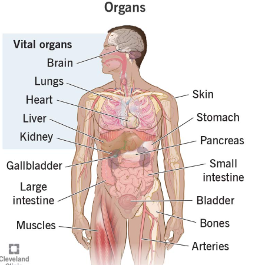

## Human Organs — Overview

.jpg)
---

### 🧠 Vital Organs

**Brain**
The control center of the body. It processes sensory information, controls movement, regulates bodily functions (breathing, heartbeat), and is responsible for thought, memory, and emotion.

**Lungs**
Two spongy organs that facilitate gas exchange — breathing in oxygen and expelling carbon dioxide. They work with the heart to oxygenate the blood.

**Heart**
A muscular pump that circulates blood throughout the body, delivering oxygen and nutrients to tissues while removing waste products.

**Liver**
The body's largest internal organ. It detoxifies the blood, produces bile for digestion, stores glycogen for energy, and synthesizes proteins.

**Kidney**
A pair of bean-shaped organs that filter waste and excess fluids from the blood, producing urine. They also regulate blood pressure and electrolyte balance.

---

### 🫁 Digestive & Abdominal Organs

**Stomach**
A muscular sac that receives food, churns it with acid and enzymes, and begins the process of digestion before passing it to the small intestine.

**Pancreas**
Serves a dual role — it produces digestive enzymes (exocrine function) and hormones like insulin and glucagon to regulate blood sugar (endocrine function).

**Small Intestine**
A long, coiled tube (~6–7 meters) where most nutrient absorption occurs. Digested food from the stomach is broken down further and absorbed into the bloodstream here.

**Large Intestine**
Absorbs water and electrolytes from indigestible food matter, forming and storing feces before elimination. It includes the colon and rectum.

**Gallbladder**
A small pouch that stores bile produced by the liver and releases it into the small intestine to help digest fats.

**Bladder**
A hollow, muscular organ that collects and stores urine from the kidneys until it is expelled from the body.

---

### 🦴 Structural & Connective Organs

**Skin**
The body's largest organ by surface area. It acts as a protective barrier against infection, regulates temperature, provides sensation, and prevents water loss.

**Muscles**
Enable movement by contracting and relaxing. They also support posture, generate body heat, and assist in functions like digestion and circulation.

**Bones**
Form the skeletal framework of the body. They provide structure, protect vital organs, enable movement (with muscles), store minerals like calcium, and produce blood cells in bone marrow.

**Arteries**
Blood vessels that carry oxygenated blood away from the heart to the rest of the body. They have thick, elastic walls to handle high blood pressure.