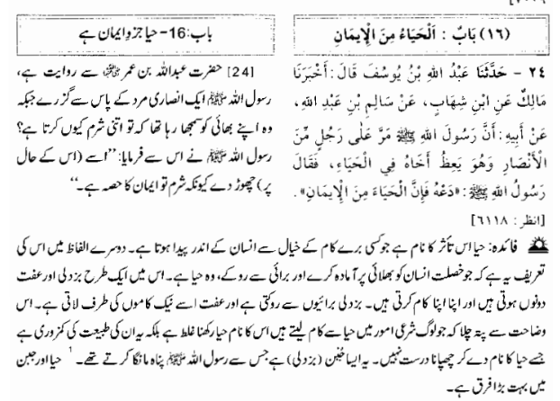
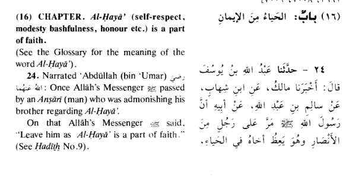

---

> **"Haya (Modesty/Shyness) is a characteristic that only thinks about good deeds. The second benefit is that it develops within a person the quality of generosity and protects from evil. In this way, it encourages a person toward goodness and away from bad deeds. Both of these are its qualities — it replaces bad deeds with good ones, and modesty keeps a person away from evil and directs them toward righteous actions.**
>
> **It is clear from this that people who say 'Haya is an obstacle in worldly work' — calling this statement wrong is not enough, rather it shows weakness of character. Haya should never be hidden — this is what the Prophet Muhammad ﷺ used to do. Haya and Iman (faith) are deeply connected."**

---

## 🔍 Key Concept Breakdown

### What is **Haya (حیا)**?
It is an Islamic concept that combines **modesty, shyness, self-respect, and moral consciousness** — far deeper than just "shyness" in English.

---

## 💡 Main Points Explained

**1. Haya encourages goodness**
It acts as an internal moral compass — naturally pushing a person toward good actions and away from sin, without needing external force.

**2. Haya develops generosity**
A modest person naturally becomes more giving and less selfish, because ego and arrogance — the roots of greed — are reduced.

**3. Common misconception corrected**
Some people claim *"Haya holds you back in the real world"* — the text strongly rejects this, calling it a sign of weak character, not wisdom.

**4. Haya is a Sunnah**
The Prophet Muhammad ﷺ himself practiced and promoted Haya. It is not something to be hidden or ashamed of.

**5. Haya and Iman are linked**
In a famous Hadith: *"Haya is a branch of Iman (faith)"* — meaning a person with true faith naturally possesses modesty.

---

## 📊 Two Benefits of Haya (as mentioned in text)

| Benefit | Explanation |
|---|---|
| ✅ Encourages Good | Pushes you toward honest, noble, righteous actions |
| 🚫 Prevents Evil | Acts as a barrier against sin, bad behavior, and moral corruption |

---

> **In short:** Haya is not a weakness — it is one of the strongest moral qualities a person can have, and it is a sign of both strong character and strong faith.