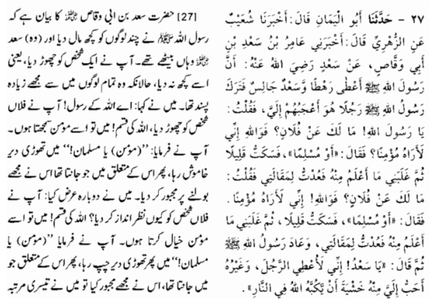
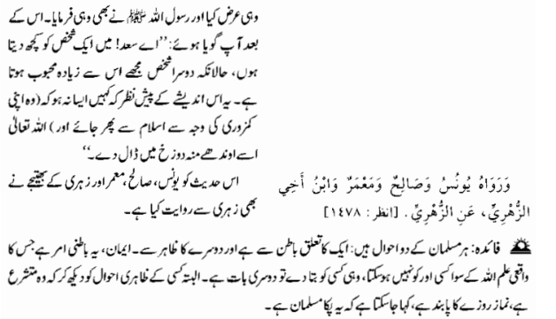
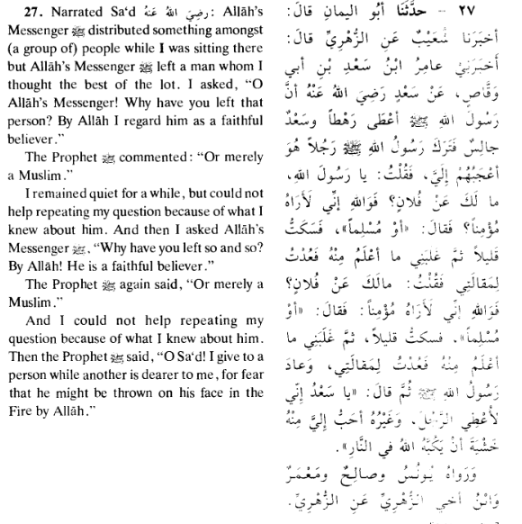

## Translation & Explanation

---

### 💬 What the Hadith Says (Simply Explained)

> The narrator kept repeating his question because he was curious/concerned about someone. The Prophet ﷺ replied:
>
> **"O Sa'd! Sometimes I give gifts/provisions to a person even though someone else is more beloved to me — because I fear that if I don't, that less-loved person might be thrown face-first into the Hellfire by Allah."**

---

### 🔍 Deep Meaning — Point by Point

**1. The Prophet ﷺ had priorities beyond personal love**
He didn't just give to those he loved most. He gave based on **who needed guidance more** — showing wisdom over emotion.

**2. "Thrown on his face in the Fire"**
This refers to a person whose **weak faith or impatience** might lead them to disbelief or sin if they felt ignored or neglected — so the Prophet ﷺ gave them attention to **protect their Iman.**

**3. Strategic compassion**
This teaches that true leadership and care means sometimes giving **more attention to the weak** than to the already strong.

---

### 📊 Key Lesson Table

| Principle | Meaning |
|---|---|
| 💝 Give beyond personal preference | Care for those who need it most, not just those you love |
| 🛡️ Protect weak faith | Extra attention to spiritually vulnerable people |
| ⚖️ Wisdom over emotion | Decisions based on greater good, not feelings |
| 🔥 Fear of their punishment | The Prophet ﷺ genuinely feared for every person's salvation |

---

### 🌟 Real Life Application

> If you are a **leader, teacher, parent, or manager** — this Hadith teaches you to give **extra time and care to those who are struggling**, even if others are closer to your heart. The goal is to **bring everyone to safety**, not just favor the already strong.