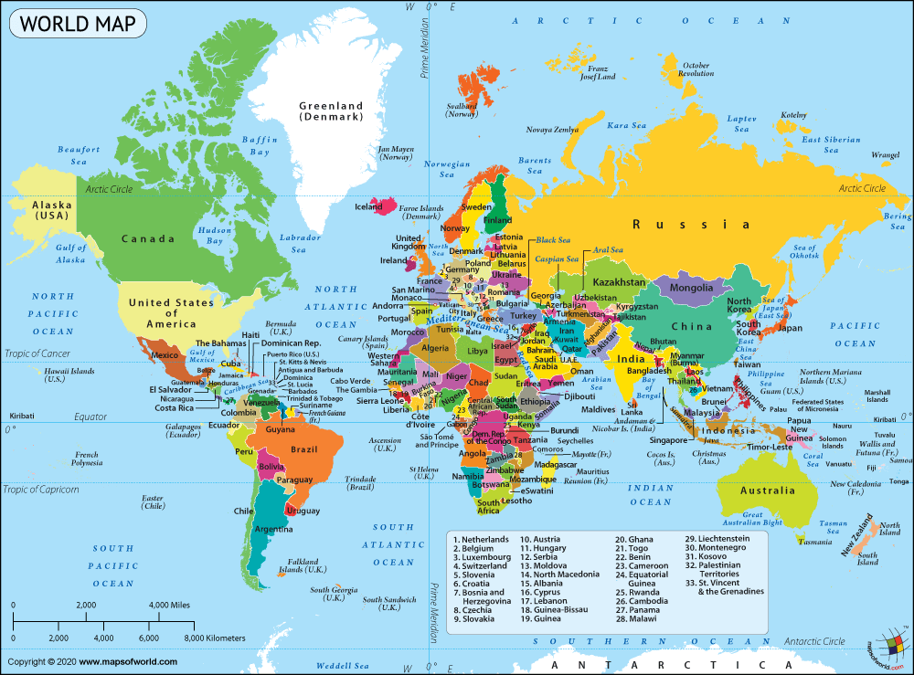

---

# 🌍 **ASIA**

| Country      | Capital                   |
| ------------ | ------------------------- |
| India        | New Delhi                 |
| China        | Beijing                   |
| Japan        | Tokyo                     |
| South Korea  | Seoul                     |
| North Korea  | Pyongyang                 |
| Pakistan     | Islamabad                 |
| Bangladesh   | Dhaka                     |
| Sri Lanka    | Sri Jayawardenepura Kotte |
| Nepal        | Kathmandu                 |
| Bhutan       | Thimphu                   |
| Afghanistan  | Kabul                     |
| Saudi Arabia | Riyadh                    |
| UAE          | Abu Dhabi                 |
| Qatar        | Doha                      |
| Kuwait       | Kuwait City               |
| Oman         | Muscat                    |
| Iran         | Tehran                    |
| Iraq         | Baghdad                   |
| Israel       | Jerusalem                 |
| Turkey       | Ankara                    |
| Thailand     | Bangkok                   |
| Vietnam      | Hanoi                     |
| Indonesia    | Jakarta                   |
| Malaysia     | Kuala Lumpur              |
| Philippines  | Manila                    |
| Singapore    | Singapore                 |
| Myanmar      | Naypyidaw                 |
| Cambodia     | Phnom Penh                |
| Laos         | Vientiane                 |
| Mongolia     | Ulaanbaatar               |

---

# 🌍 **EUROPE**

| Country        | Capital    |
| -------------- | ---------- |
| United Kingdom | London     |
| France         | Paris      |
| Germany        | Berlin     |
| Italy          | Rome       |
| Spain          | Madrid     |
| Portugal       | Lisbon     |
| Netherlands    | Amsterdam  |
| Belgium        | Brussels   |
| Switzerland    | Bern       |
| Austria        | Vienna     |
| Sweden         | Stockholm  |
| Norway         | Oslo       |
| Denmark        | Copenhagen |
| Finland        | Helsinki   |
| Poland         | Warsaw     |
| Czech Republic | Prague     |
| Hungary        | Budapest   |
| Greece         | Athens     |
| Ireland        | Dublin     |
| Ukraine        | Kyiv       |
| Romania        | Bucharest  |
| Bulgaria       | Sofia      |

---

# 🌍 **AFRICA**

| Country      | Capital                   |
| ------------ | ------------------------- |
| Nigeria      | Abuja                     |
| Egypt        | Cairo                     |
| South Africa | Pretoria (administrative) |
| Kenya        | Nairobi                   |
| Ethiopia     | Addis Ababa               |
| Ghana        | Accra                     |
| Morocco      | Rabat                     |
| Algeria      | Algiers                   |
| Tunisia      | Tunis                     |
| Libya        | Tripoli                   |
| Sudan        | Khartoum                  |
| Uganda       | Kampala                   |
| Tanzania     | Dodoma                    |
| Zimbabwe     | Harare                    |
| Zambia       | Lusaka                    |
| Botswana     | Gaborone                  |
| Namibia      | Windhoek                  |
| Senegal      | Dakar                     |

---

# 🌍 **NORTH AMERICA**

| Country       | Capital          |
| ------------- | ---------------- |
| United States | Washington, D.C. |
| Canada        | Ottawa           |
| Mexico        | Mexico City      |
| Cuba          | Havana           |
| Jamaica       | Kingston         |
| Panama        | Panama City      |
| Costa Rica    | San José         |
| Guatemala     | Guatemala City   |
| Honduras      | Tegucigalpa      |
| El Salvador   | San Salvador     |

---

# 🌍 **SOUTH AMERICA**

| Country   | Capital      |
| --------- | ------------ |
| Brazil    | Brasília     |
| Argentina | Buenos Aires |
| Chile     | Santiago     |
| Peru      | Lima         |
| Colombia  | Bogotá       |
| Venezuela | Caracas      |
| Ecuador   | Quito        |
| Bolivia   | Sucre        |
| Paraguay  | Asunción     |
| Uruguay   | Montevideo   |

---

# 🌍 **AUSTRALIA / OCEANIA**

| Country          | Capital      |
| ---------------- | ------------ |
| Australia        | Canberra     |
| New Zealand      | Wellington   |
| Fiji             | Suva         |
| Papua New Guinea | Port Moresby |
| Samoa            | Apia         |
| Tonga            | Nukuʻalofa   |
| Solomon Islands  | Honiara      |
| Vanuatu          | Port Vila    |

---

# 🌍 **ANTARCTICA**

* ❌ No countries
* Only research stations

---

## Important Notes (Exam/Interview)

* **South Africa** → 3 capitals:

  * Pretoria (Executive)
  * Cape Town (Legislative)
  * Bloemfontein (Judicial)

* **Sri Lanka** → Administrative capital = Sri Jayawardenepura Kotte, but Colombo is commercial capital

---

# 🌍 **Russia**

Russia is a bit special — it is **not limited to just one continent**.

* **Russia lies in both:**
  * **Europe**
  * **Asia**

### How it is divided
* The **Ural Mountains** act as the natural boundary
* **West of Ural → Europe**
* **East of Ural → Asia**

### Important facts
* Capital: **Moscow** → located in **European part**
* About **75% land → Asia**
* About **25% population → Europe (major cities here)**
* Russia is called a **transcontinental country**

 

---

 

# The **main transcontinental countries** (countries that lie in more than one continent), explained simply:

**1. Europe + Asia (Eurasia)**

| Country        | Notes                           |
| -------------- | ------------------------------- |
| **Russia**     | Biggest country, mostly in Asia |
| **Turkey**     | Split by Bosporus Strait        |
| **Kazakhstan** | Small part in Europe            |
| **Azerbaijan** | Caucasus region                 |
| **Georgia**    | Sometimes counted in Europe     |
| **Armenia**    | Cultural link to Europe         |

**2. Africa + Asia**

| Country   | Notes                        |
| --------- | ---------------------------- |
| **Egypt** | Sinai Peninsula lies in Asia |

**3. North America + South America**

| Country    | Notes                    |
| ---------- | ------------------------ |
| **Panama** | Connects both continents |

**4. Asia + Oceania**

| Country              | Notes                         |
| -------------------- | ----------------------------- |
| **Indonesia**        | Some islands in Oceania       |
| **Papua New Guinea** | Near Asia boundary            |
| **Timor-Leste**      | Southeast Asia & Oceania link |

